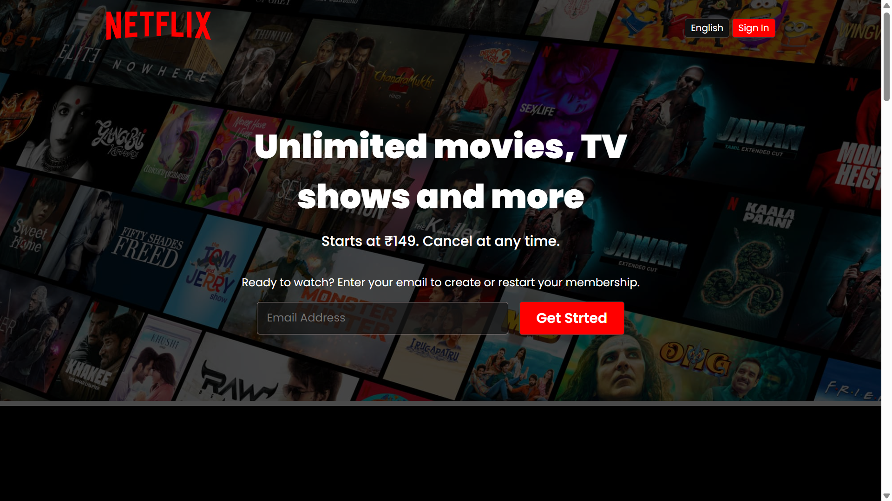
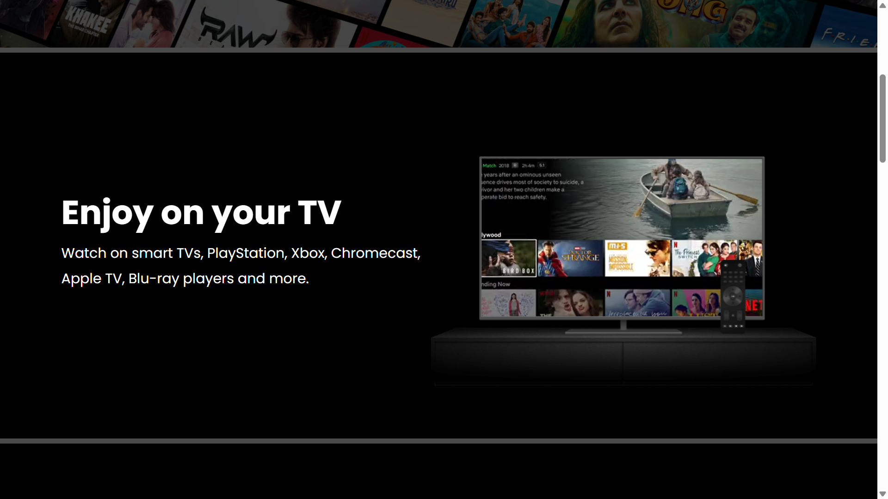
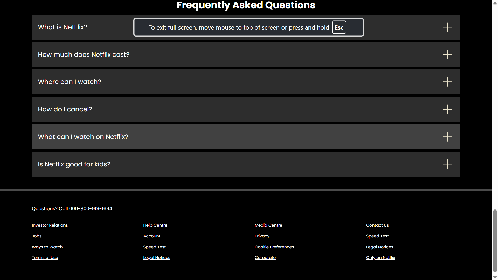

# 🎬 Netflix Clone

This is a simple **Netflix Clone** homepage built using **HTML** and **CSS** only.  
It replicates the front-end design of Netflix's landing page with a responsive layout and modern styling.

## 🌐 Live Demo

👉 [Click here to view the live site](https://manish6862.github.io/netflix-clone/)

## 🔧 Technologies Used

- HTML5  
- CSS3  
- Responsive Web Design 

## 📁 Features

- 🎥 Hero section with background image and overlay text  
- 📱 Fully responsive layout (mobile, tablet, desktop)  
- 🔤 Modern fonts and smooth UI  
- 🎨 Clean CSS styling with hover effects  
- 🚫 No JavaScript used — purely static website  

## 📷 Screenshots

### 🖥️ Homepage View

### 📱 Movie View

### 📱 Footer View

⚠️ This project is a **static UI clone of Netflix** made for educational purposes only. It does not include any real login, streaming, or backend services.

